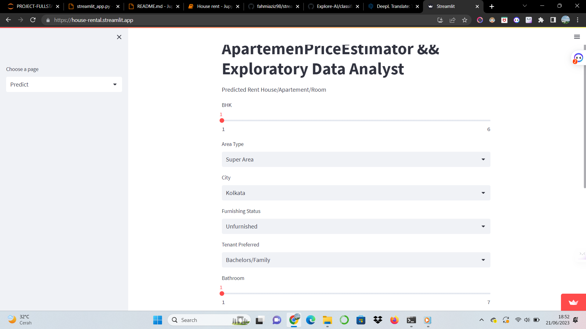
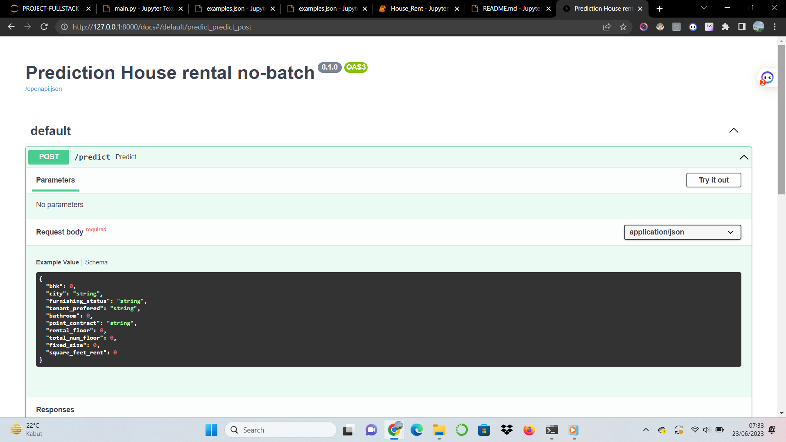
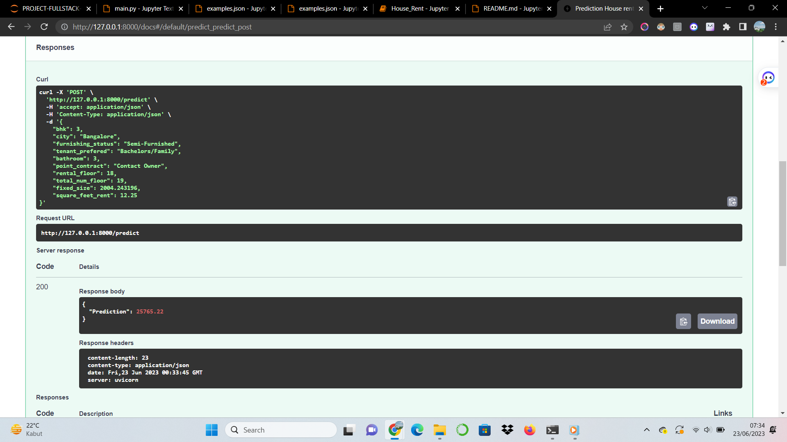
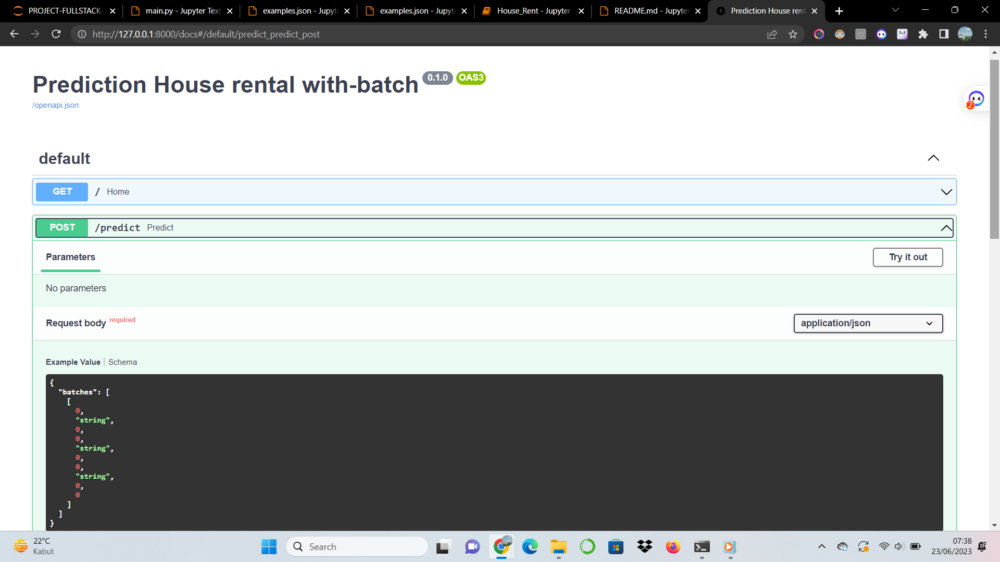
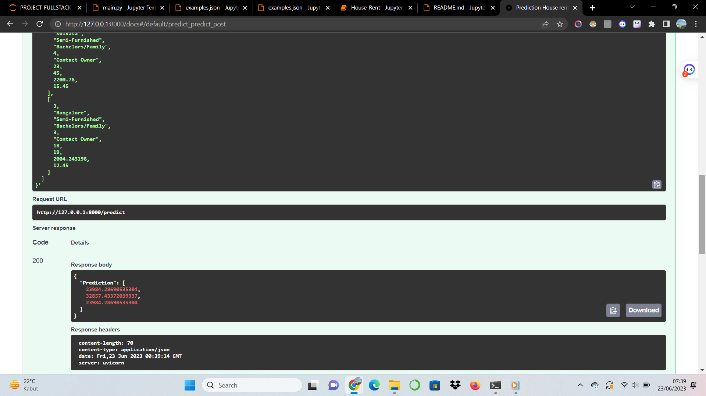

# House Price Prediction Using Machine Learning Algorithms: A Case Study in the Real Estate Industry

## Problem Statement
The goal of this project is to analyze the house rental dataset and build a predictive model that can estimate the rent of a house based on its features. The project involves performing exploratory data analysis (EDA) to gain insights, preprocessing the data, selecting a suitable machine learning algorithm, tuning the model hyperparameters, and finally deploying the model using Streamlit.

## Motivation
The House Rental Dataset aims to provide valuable insights into the housing rental market in India. Renting a house is a common practice, and understanding the factors that influence rental prices can be beneficial for various stakeholders.

For Tenants:
- Renters can gain insights into the rental market, helping them make informed decisions about the properties they choose to rent.
- Understanding the rental trends in different cities and localities can help tenants find affordable housing options that meet their requirements.

For Property Owners and Agents:
- Property owners and agents can use the dataset to assess the current rental market and determine competitive rental prices for their properties.
- Analyzing the preferred tenant types and furnishing statuses can help property owners target their marketing efforts effectively.

For Researchers and Analysts:
- Researchers and analysts can explore the dataset to uncover patterns and trends in the rental market, providing valuable insights into the housing sector in India.
- The dataset can serve as a basis for conducting further analysis, developing predictive models, and generating recommendations for housing policies.

## About Dataset
This dataset contains information about house rentals in India. The dataset includes various parameters such as the number of bedrooms, rent, size, floor details, area type, area locality, city, furnishing status, preferred tenant type, number of bathrooms, and point of contact.
The dataset can be downloaded from [Kaggle](https://www.kaggle.com/).
#### Dataset Glossary (Column-Wise)
- BHK: Number of Bedrooms, Hall, Kitchen.
- Rent: Rent of the Houses/Apartments/Flats.
- Size: Size of the Houses/Apartments/Flats in Square Feet.
- Floor: Houses/Apartments/Flats situated on which floor and total number of floors (Example: Ground out of 2, 3 out of 5, etc.)
- Area Type: Size of the Houses/Apartments/Flats calculated on either Super Area or Carpet Area or Build Area.
- Area Locality: Locality of the Houses/Apartments/Flats.
- City: City where the Houses/Apartments/Flats are located.
- Furnishing Status: Furnishing Status of the Houses/Apartments/Flats, either it is Furnished or Semi-Furnished or Unfurnished.
- Tenant Preferred: Type of Tenant Preferred by the Owner or Agent.
- Bathroom: Number of Bathrooms.
- Point of Contact: Whom should you contact for more information regarding the Houses/Apartments/Flats.

## Learning Objectives
By working with the House Rental Dataset, you can achieve the following learning objectives:

1. Exploratory Data Analysis (EDA):
   - Perform data exploration to gain insights into the distribution, relationships, and summary statistics of the rental dataset.
   - Visualize various features and their impact on rental prices, such as the number of bedrooms, location, furnishing status, and more.
   - Identify any outliers, missing values, or data inconsistencies that need to be addressed.

2. Data Preprocessing and Feature Engineering:
   - Handle missing values, outliers, and any data quality issues in the dataset.
   - Perform feature engineering to create new meaningful features that can enhance the predictive power of the models.
   - Encode categorical variables and standardize numerical features to prepare the data for modeling.

3. Model Selection and Tuning:
   - Select appropriate machine learning models for predicting rental prices based on the given dataset.
   - Evaluate and compare the performance of different models using appropriate evaluation metrics.
   - Fine-tune the selected models by optimizing hyperparameters to improve their predictive accuracy.

4. Model Deployment with Streamlit:
   - Build an interactive web application using Streamlit to showcase the trained model's predictions.
   - Enable users to input relevant features of a property and obtain an estimated rental price.
   - Deploy the web application on a suitable platform to make it accessible to users.

## Accuracy Model

After training and tuning the machine learning model on the Home Rental Dataset, the performance of the best model is evaluated using accuracy as the evaluation metric. The model accuracy on the test set is 98%, which shows how well the model predicts the rental price based on the given features.

The figure above shows a visualization of the model accuracy, which indicates the predictive power of the trained model.

## Tabel Accuracy

The table below presents the accuracy scores of different machine learning models evaluated during the model selection and tuning process:

| Model           |  Accuracy Score |  RMSE  |
|-----------------|---------------- |--------|
| XGBRegressor    |      0.984      |  2698  |
| LGBMRegressor   |      0.986      |  2547  |

The table provides a comparison of the accuracy scores achieved by each model, enabling us to identify the best-performing model for predicting rental prices in the House Rental Dataset. As you can see, the model has an overfit because there are too many outliers, and I tried replacing the outliers with intervals and the result is that the model has a considerable drop in accuracy.

## Deploy with streamlit

**Demo application [here](https://house-rent.streamlit.app/)**

## Deploy model with FastAPI and Docker
#### 1.) no-batch

This time I experimented with deploying a model using FastAPI and Docker. My first experiment was to perform non-batch predictions [here](https://github.com/fahmiaziz98/streamlit-app/tree/main/FastAPI/no-batch). if you run in the local use command `uvicorn main:app --reload`

#### 2.) with-batch

And in my second experiment, I made predictions with batches [here](https://github.com/fahmiaziz98/streamlit-app/tree/main/FastAPI/with-batch)

## Conclusion
In this project, I developed a machine learning model to predict house rental prices based on various features. By analyzing the dataset, performing data preprocessing, and selecting suitable machine learning algorithms, I was able to build an accurate predictive model.

The project aimed to provide valuable insights into the housing rental market in India. Through exploratory data analysis, I gained insights into the dataset and addressed data inconsistencies. The dataset included information such as the number of bedrooms, rent, size, floor details, area type, area locality, city, furnishing status, preferred tenant type, number of bathrooms, and point of contact.

By applying machine learning techniques, I developed predictive models and evaluated their performance using metrics such as accuracy and RMSE. The best-performing models were XGBRegressor and LGBMRegressor, achieving high accuracy scores.

To make the model accessible to users, I deployed it using Streamlit, allowing users to input property features and obtain rental price estimates. I also experimented with deploying the model using FastAPI and Docker.

Overall, this project provided valuable insights into the rental market in India and demonstrated the application of machine learning algorithms in predicting house rental prices.
